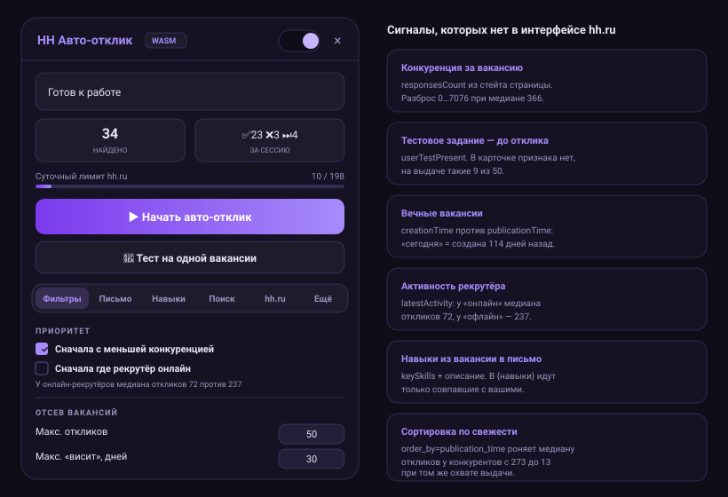

# HH Auto-Responder Pro

A Chrome extension that applies to hh.ru vacancies for you — and is picky about which ones.

A typical auto-applier clicks "Respond" down the whole result list. This one first reads the data hh.ru ships to the browser but **never renders**: how many people already applied, whether a test assignment is required, how long the posting has really been recycled, whether the recruiter is online right now. Only then does it decide whether a vacancy is worth one of your 200 daily applications.

[Русская версия](README.ru.md) · [Install](#install) · [How it works](#what-the-extension-sees-and-you-dont) · [Settings](#settings)



> The interface diagram is hand-drawn SVG mirroring the actual panel markup — same tabs, colours and labels.

---

## Why bother

hh.ru caps you at 200 applications per day. The problem was never clicking a button 200 times — it is deciding **where** those 200 go.

Measured on a live `javascript` / Moscow search, 50 vacancies per page:

| What the list shows | What is actually true |
|---|---|
| "Posted today" | 11 of 50 have a creation-to-republication gap of **over a month**; the record is 114 days |
| Every card looks the same | 9 of 50 require a **test assignment**, with no hint on the card |
| Sorted "by relevance" | competitors' median application count is **273**; with `order_by=publication_time` it drops to **13** at identical coverage |
| Searching for "javascript" | an excavator-operator vacancy shows up — hh.ru searches the full text, not the title |

The extension acts on that data instead of on card order.

---

## What the extension sees and you don't

hh.ru embeds a JSON blob with every vacancy into each search page. It carries fields the card markup never shows:

| Field | What it buys you |
|---|---|
| `userTestPresent` | test assignments detected **before** applying — 14 ms for the whole page instead of loading every vacancy |
| `responsesCount` | real competition per vacancy; the queue is sorted least-contested first |
| `creationTime` vs `publicationTime` | zombie postings: "today" can mean "created four months ago" |
| `employerManager.latestActivity` | online recruiters carry a median of 72 applications against 237 for offline ones |
| `@responseLetterRequired` | a mandatory letter is sent even when cover letters are switched off |
| `keySkills` from the vacancy page | the `{навыки}` placeholder receives only the skills this vacancy actually asks for |

On top of that, hh.ru's own server-side filters are pushed straight into the search URL: `search_field=name`, `label=not_from_agency`, `label=accredited_it`, `label=low_performance`, `work_format`, `experience`, `salary`, `search_period`. The server returns an already-filtered page, so the bot no longer throws away 45 cards out of 50 after loading them.

---

## Install

The extension is not on the Chrome Web Store; load it unpacked.

1. Download `hh-auto-responder-v2.5.zip` from the [latest release](../../releases/latest) and unzip it.
2. Open `chrome://extensions/`.
3. Enable **Developer mode** (top right).
4. **Load unpacked** → pick the folder.
5. Open hh.ru — the panel appears on the right.

Chrome 111+ required. The extension itself has no dependencies; `npm` is only needed to build the WASM module and run tests.

---

## Settings

The panel is split into six tabs.

**Filters** — queue priority (least competition, recruiter online) plus rejection rules: maximum applications per vacancy, minimum salary, freshness, recycling age, work format, experience, employer rating and the share of applications they actually review. Blocklists and allowlists for words and organisations live here too.

**Letter** — a template with `{вакансия}`, `{компания}` and `{навыки}` placeholders, plus a second variant for A/B testing. A line whose placeholder cannot be filled is dropped entirely, so no employer ever receives a literal `{навыки}`.

**Skills** — your list, a match threshold and precise matching against the vacancy page.

**Search** — pushing filters to hh.ru's side and a queue of search URLs: when one is exhausted the bot moves to the next.

**hh.ru** — bumping your CV in search (optionally every four hours), bookmarking vacancies skipped over a test, the server-side blocklist, importing saved searches.

**More** — pacing, night mode, conversion report, CSV export, settings backup.

---

## Conversion report

The "Конверсия" button reads application statuses from hh.ru and breaks them down three ways:

- **by letter variant** — which text earns interviews;
- **by CV** — computed from hh.ru's own data, so it covers manually sent applications too;
- **by competition** — whether the sorting pays off, bucketed as under 20 / 20–50 / 50–200 / 200–500 / 500+.

It also collects the "reviews N% of applications" figure that hh.ru only shows after you apply. The number belongs to the employer, so once learned it filters out that company's other vacancies.

---

## Fingerprint defence

The extension spoofs exactly what cannot be cross-checked against request headers and **leaves alone** what can: user agent, language, timezone, memory and core count are taken from the real browser. Spoofing anything the headers contradict would itself be the tell.

- Canvas and audio noise, text metrics and WebGL parameters are computed in an 842-byte WASM module with zero imports.
- The noise seed is **stable per installation** and kept in `chrome.storage`. A fingerprint that changes every page load betrays automation more clearly than no defence at all.
- Hooks are installed at `document_start`, ahead of every page script. The profile arrives later and merely fills in a live object — nothing is re-patched.
- Patched functions are masked as native through `Function.prototype.toString`.
- `declarativeNetRequest` blocks 22 advertising and tracking hosts.

The extension does not solve CAPTCHAs. When a challenge appears the bot **stops** and asks for a human instead of hammering it with reloads.

---

## Development

```bash
npm ci            # only needed for the WASM build and tests
npm test          # bot, protection and WASM module tests
npm run validate  # JS/JSON syntax and manifest checks
npm run build:wasm
npm run check:wasm  # byte-compares protect.wasm against wasm/protect.wat
npm run pack        # builds dist/hh-auto-responder-v2.5.zip
```

`protect.wasm` is committed so the extension installs without a toolchain. CI rebuilds it from `wasm/protect.wat` on every push and compares the bytes, so a binary that drifted from its source can never reach a release.

Releases build automatically from a tag:

```bash
git tag v2.5 && git push origin v2.5
```

The tag must match `manifest.json` or the build fails. Release notes are generated from the repository itself: the change list from commits, the archive contents from the archive, and the SHA-256 computed on the spot.

---

## Limitations

- hh.ru only, Chrome 111+.
- The 200-per-day cap is enforced by hh.ru, not by the extension. The bot counts its own applications and stops at 198.
- If your CV is hidden from an employer, hh.ru disables the apply button. The extension detects this and skips the vacancy, but the visibility setting can only be fixed in your account.
- The "reviews N%" figure is only available after your first application to that company.

## Responsibility

This tool automates your own actions in your own account. Applications go out under your name and you answer for them. Fill in the cover letter and watch where the bot applies: by default hh.ru searches the full vacancy text rather than the title.

## Licence

[MIT](LICENSE)
